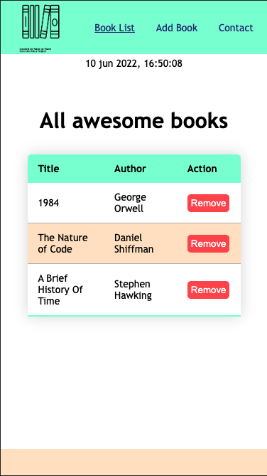

# Awesome-Books

In this project, I build a basic website that allows users to add/remove books from a list. The functionality was done using JS.

  

## Built With

- Major languages: HTML, CSS, JS. 
- Technologies used: Visual Studio Code, Git/GitHub

## Getting Started

[Live demo](https://giuseppetg.github.io/Awesome-Books/)

To run this project locally on your computer clone using "git clone" command with this repo url.
Open the file in your code editor. 
Run the project in you browser. 
Thanks for watching.

## Authors

👤 **Giuseppe Tomasini**

- GitHub: [@GiuseppeTG](https://github.com/GiuseppeTG)
- Twitter: [@giusetomasini](https://twitter.com/giusetomasini)
- LinkedIn: [Giuseppe Tomasini](https://www.linkedin.com/in/giuseppe-tomasini-67ba101a8/)

👤 **Ogiogio Victor**

- GitHub: [ogiogiovictor](https://github.com/ogiogiovictor) 
- LinkedIn: [Ogiogio Victor](https://www.linkedin.com/in/ogiogio-victor-a096a0181/)

## 🤝 Contributing

Contributions, issues, and feature requests are welcome!

Feel free to check the [issues page](../../issues/).

## Show your support

Give a ⭐️ if you like this project!

## Acknowledgments

## 📝 License

This project is [MIT](./MIT.md) licensed.
